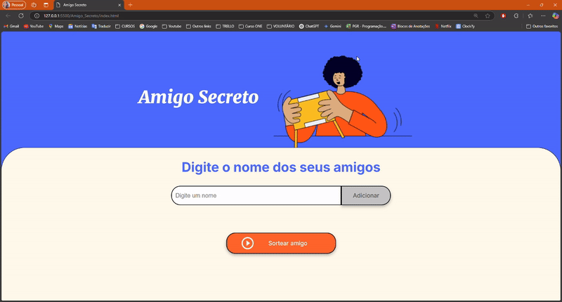

<h1 align="center"> 🎁 Jogo Amigo Secreto </h1>

*Bem-vindo ao desafio Amigo Secreto*! Um jogo simples com uma aplicação  divertida, que permite aos usuários cadastrarem nomes de amigos para realizar um sorteio aleatório e descobrir quem será o "amigo secreto". 
 

# 🎓 Créditos  

Este projeto faz parte dos desafios propostos no curso da ONE (Oracle Next Education), em parceria com a Alura, para reforçar os conceitos de manipulação do DOM e funções em JavaScript.

# 📌 Funcionalidades

- **Adicionar nomes:** Insira um nome no campo de texto e clique em "Adicionar" para incluí-lo na lista.
- **Validar entrada:** Caso o campo esteja vazio, um alerta será exibido para solicitar um nome válido.
- **Visualizar a lista:** Os nomes inseridos aparecerão automaticamente em uma lista visível.
- **Sorteio aleatório:** Clique em "Sortear Amigo" para selecionar um nome aleatoriamente e exibi-lo na tela.
- **Limpeza da lista:** Limpeza automática da lista após o sorteio.

# 🚀 Tecnologias Utilizadas
- HTML
- CSS
- JavaScript

# 📂 Estrutura do Projeto

./Amigo-Secreto
── index.html     # Estrutura da página  
── style.css      # Estilos da página  
── app.js         # Código JavaScript do jogo  
── README.md      # Documentação do projeto  

# 📷 Capturas de Tela

# 💻 Como Executar o Projeto
 1. Clone este repositório:
    git clone git@github.com:Nicole00-Freitas/Amigo_Secreto.git

2. Acesse a pasta do projeto:
    cd amigo-secreto

3. Abra o arquivo index.html em seu navegador favorito.

# 📜 Licença
Este projeto é de uso livre para estudos e melhorias.

